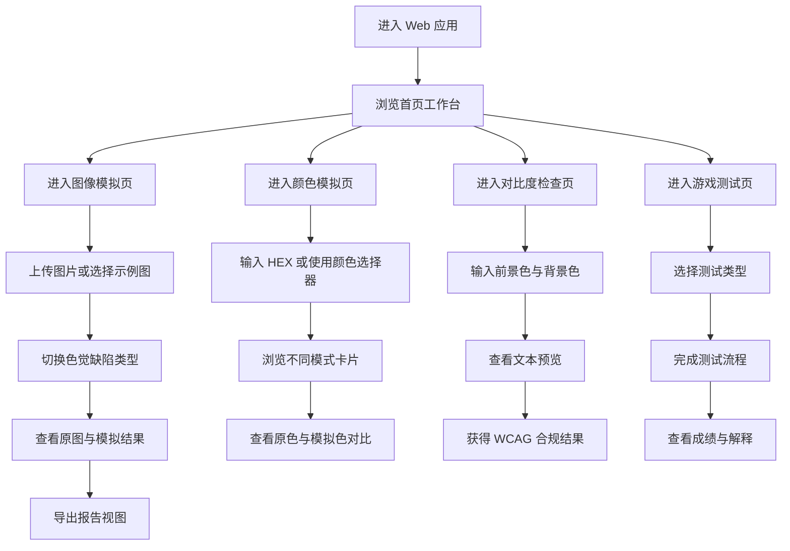

## 1. 产品概述
将当前 Figma 色觉缺陷插件转换为可独立运行的 Web 应用，保留图像模拟、颜色模拟、对比度检查与小游戏测试等核心能力。
- 目标用户为设计师、前端工程师、无障碍体验评审者，以及需要快速进行色觉缺陷验证的普通用户
- 产品价值在于脱离 Figma 运行环境后，仍可完成设计校验、色彩验证与色觉测试演示，降低使用门槛并提升传播与展示效率

## 2. 核心功能

### 2.1 用户角色
当前版本不区分角色，所有访问者均可直接使用完整功能。

### 2.2 功能模块
1. **首页工作台**：产品介绍、模式切换、能力入口、设计提示
2. **图像模拟页**：上传图片、选择色觉缺陷类型、原图与模拟结果对比、导出报告视图
3. **颜色模拟页**：输入 HEX 颜色、查看不同色觉模式下的颜色偏移、对比展示
4. **对比度检查页**：前景色/背景色输入、WCAG 比例计算、AA/AAA 合规判断
5. **游戏测试页**：Ishihara 数字识别测试、找色差挑战、马赛克阈值测试

### 2.3 页面详情
| 页面名称 | 模块名称 | 功能说明 |
|-----------|-------------|---------------------|
| 首页工作台 | 顶部导航 | 提供图像模式、颜色模式、对比度、游戏测试四个入口，支持中英切换 |
| 首页工作台 | 产品引导 | 介绍色觉缺陷模拟与无障碍设计价值，展示主要能力卡片 |
| 图像模拟页 | 图片输入 | 支持本地上传、拖拽上传、载入示例图像 |
| 图像模拟页 | 模拟类型切换 | 支持红色盲、绿色盲、蓝色盲、红色弱、绿色弱、蓝色弱等模式 |
| 图像模拟页 | 双栏预览 | 并排展示原图与模拟结果，支持空态提示与切换后即时重绘 |
| 图像模拟页 | 报告导出 | 生成适合展示的报告视图，并支持导出 PNG 截图或独立报告区域 |
| 颜色模拟页 | 颜色输入 | 支持颜色选择器与 HEX 文本输入双通道修改 |
| 颜色模拟页 | 模式卡片 | 展示不同色觉模式的模拟颜色、说明、患病率标签 |
| 颜色模拟页 | 对比区 | 展示原始颜色与模拟颜色色块和十六进制值 |
| 对比度检查页 | 双色输入 | 输入前景色与背景色并实时更新预览 |
| 对比度检查页 | 文字预览 | 以不同字号展示真实文本对比效果 |
| 对比度检查页 | 合规分析 | 计算对比度并判断 WCAG 2.1 的 AA/AAA 是否通过 |
| 游戏测试页 | 游戏大厅 | 展示三种测试入口及简短说明 |
| 游戏测试页 | Ishihara 测试 | 使用 11 张标准色板完成数字识别并输出诊断建议 |
| 游戏测试页 | 找色差挑战 | 限时点击不同色块并输出成绩和称号 |
| 游戏测试页 | 马赛克阈值测试 | 在动态色块中识别目标，输出不同轴向的色觉阈值结果 |

## 3. 核心流程
用户进入站点后，先在首页工作台理解产品能力，再按目标任务进入图像模拟、颜色模拟、对比度检查或游戏测试。图像模式下用户上传图片并切换缺陷类型查看前后对比；颜色模式下用户输入单一颜色并查看不同色觉结果；对比度检查中用户输入前景色和背景色并即时获取无障碍评级；游戏测试中用户完成题目后获得结果反馈与设计建议。

## 4. 用户界面设计
### 4.1 设计风格
- 主色采用陶土橙、暖米白、深墨褐，延续当前插件的编辑器工具气质
- 按钮风格采用硬边矩形与轻微高亮渐变，强调“实验工具”而非营销站点
- 字体采用中文衬线标题搭配易读无衬线正文，保留工具感同时提升识别性
- 布局采用桌面优先的工作台结构，核心区域使用双栏预览、卡片横向滚动和仪表板式分组
- 图标建议使用线性图标系统，搭配少量游戏化图形增强趣味性

### 4.2 页面设计概览
| 页面名称 | 模块名称 | UI 元素 |
|-----------|-------------|-------------|
| 首页工作台 | 顶部区域 | 标题、语言切换、功能导航、说明文案 |
| 图像模拟页 | 对比工作区 | 上传区、模式切换按钮、双栏画布、导出按钮 |
| 颜色模拟页 | 模拟卡片区 | 色彩输入框、横向模式卡片、对比色块、标签徽章 |
| 对比度检查页 | 分析面板 | 双色输入、文本预览、比值卡片、合规状态卡 |
| 游戏测试页 | 测试大厅 | 入口卡片、引导页、进度条、答题区、结果页 |

### 4.3 响应式
- 采用桌面优先设计，针对平板与移动端进行自适应重排
- 大屏保持双栏与多卡片布局，小屏切换为单列滚动布局
- 支持触控交互，确保按钮、色块与输入区域在移动端可点击

### 4.4 视觉与交互补充
- 图像与颜色模拟结果需支持无刷新即时反馈
- 游戏测试流程需具备清晰的空态、进行中、完成态切换
- 导出报告区域需保持固定视觉结构，便于截图和分享
