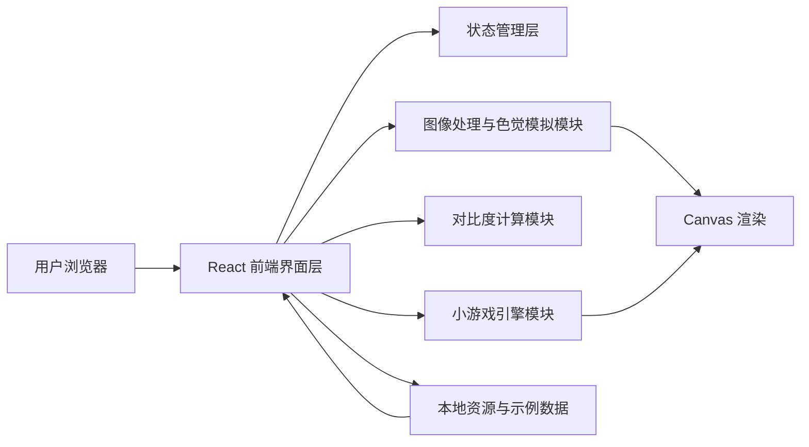
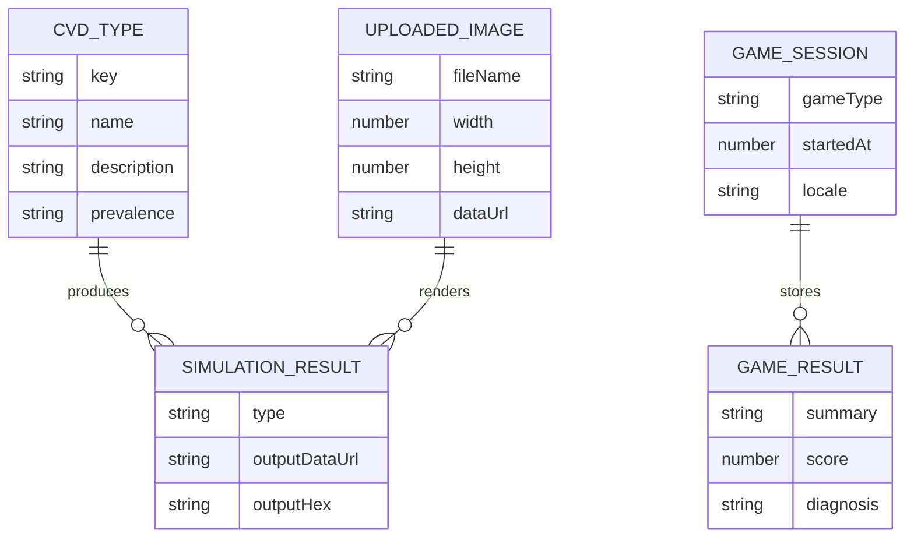

## 1. 架构设计
本项目采用纯前端 Web 架构，将原 Figma 插件中的界面层与计算逻辑迁移到浏览器端执行。图像输入由 Figma 选区改为本地上传、拖拽上传与示例资源加载；图像处理、色觉模拟、对比度计算与小游戏逻辑均在前端完成，无需外部后端服务。



## 2. 技术说明
- 前端：React@18 + TypeScript + Vite + Tailwind CSS
- 初始化工具：vite-init
- 状态管理：zustand
- 图标库：lucide-react
- 图像处理：浏览器 Canvas API
- 测试：Vitest + React Testing Library
- 资源使用：沿用现有 `assets/ishihara` 中的色板 SVG，并将原有模拟矩阵与本地化文案迁移为模块化数据

## 3. 路由定义
| 路由 | 用途 |
|-------|---------|
| `/` | 首页工作台，展示全部能力入口与产品说明 |
| `/image` | 图像模拟页，上传图片并查看色觉缺陷效果 |
| `/color` | 颜色模拟页，查看单色在不同色觉模式下的变化 |
| `/contrast` | 对比度检查页，执行 WCAG 2.1 对比度分析 |
| `/games` | 游戏测试大厅，进入三类测试 |
| `/games/ishihara` | Ishihara 数字识别测试 |
| `/games/color-diff` | 找色差挑战 |
| `/games/mosaic` | 马赛克色觉阈值测试 |

## 4. API 定义
本项目首版不引入后端服务，不定义远程 API。所有计算均在前端本地完成。

### 4.1 前端核心类型
```ts
export type CvdType =
  | "normal"
  | "protanopia"
  | "deuteranopia"
  | "tritanopia"
  | "protanomaly"
  | "deuteranomaly"
  | "tritanomaly";

export interface UploadedImage {
  fileName: string;
  width: number;
  height: number;
  dataUrl: string;
}

export interface SimulatedColorInfo {
  type: CvdType;
  name: string;
  hex: string;
  description: string;
  prevalence: string;
}

export interface ContrastResult {
  ratio: number;
  aaNormal: boolean;
  aaLarge: boolean;
  aaaNormal: boolean;
  aaaLarge: boolean;
}
```

## 5. 数据模型
### 5.1 数据模型定义


### 5.2 数据定义说明
- `CVD_TYPE` 为前端静态配置，定义色觉类型、文案与患病率标签
- `UPLOADED_IMAGE` 表示用户本地上传的图像信息，不落库，仅存在内存或会话态
- `SIMULATION_RESULT` 表示图像或颜色在指定色觉模式下的结果，用于界面渲染和导出
- `GAME_SESSION` 与 `GAME_RESULT` 仅用于前端状态管理与结果展示，首版不做持久化

## 6. 模块拆分
- `src/pages`：承载首页、图像模拟、颜色模拟、对比度检查、游戏大厅与各测试页面
- `src/components`：承载导航栏、上传面板、预览卡片、颜色卡片、结果面板、游戏通用组件
- `src/utils`：放置 HEX 处理、色觉矩阵变换、对比度计算、计时与随机工具函数
- `src/hooks`：封装图片上传、Canvas 绘制、键盘输入与游戏流程控制逻辑
- `src/store`：集中管理语言、当前模式、上传图片、模拟类型和游戏状态

## 7. 迁移策略
- 保留原插件的核心视觉气质、色觉矩阵算法、Ishihara 色板资源与双语文案
- 替换 Figma 专属能力，如 `figma.currentPage.selection`、`parent.postMessage` 和报告回写画布逻辑
- 将报告导出改为浏览器端截图式导出或单独报告组件渲染
- 将单文件 `ui.html` 中的样式、文案、计算逻辑拆分为 React 页面、组件与工具模块

## 8. 测试策略
- 为颜色模拟与对比度计算编写单元测试，覆盖常用输入和边界情况
- 为关键页面组件编写渲染测试，验证文案、按钮与核心区域存在
- 执行 `npm run check` 验证 TypeScript 与项目质量脚本
- 启动开发服务器进行人工预览，确认路由切换、图片上传和交互流程正常
